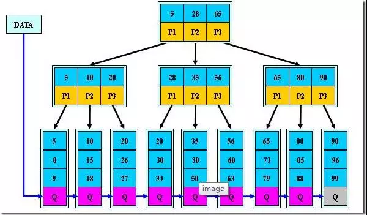
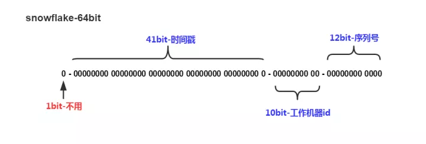

*所有的业务系统，都有生成ID的需求，如订单id，商品id，文章ID等。这个ID会是数据库中的唯一主键;有些时候我们希望能使用一种简单一些的ID，并且希望ID能够按照某种规律有序生成（方便客户端排序）*

*twitter的snowflake解决了这种需求，最初Twitter把存储系统从MySQL迁移到Cassandra，因为Cassandra没有顺序ID生成机制，所以开发了这样一套全局唯一ID生成服务*

### 为啥需要全局唯一？全局唯一的应用场景？
1.MQ有序消费  
2.MVCC实现  
3.分表分库场景  
举个例子：身份证号码确实是对人唯一的，然而一个人是可以办理多个身份证的，例如你身份证丢了，又重新补办了一张，号码不变。
问题来了，因为系统是按照身份证号码做唯一主键的。此时，如果身份证是被盗的情况下，你是没有办法在系统里面注销的，因为新旧2个身份证的“主键”都是身份证号码。  
也就是说，旧的身份证仍然逍遥在外，完全有效。这个时候，还好有一个身份证有效时间的东西，只有靠身份证有效期来辨识了。不过，这就是现在这么多银行，电信诈骗的由来，捡到一张身份证，去很多银行，手机，酒店都可以使用！身份证缺乏注销机制！  
所以，经验告诉我们。不要相信自己的直觉，业务上所谓的唯一往往都是不靠谱的，经不起时间的考研的。所以需要单独设置一个和业务无关的主键，专业术语叫做代理主键（surrogate key）。
这也是为什么数据库设计范式，**唯一主键**是第一范式！

### 为什么要趋势有序？###  

以mysql为例，InnoDB引擎表是基于B+树的索引组织表(IOT)；每个表都需要有一个聚集索引(clustered index)；所有的行记录都存储在B+树的叶子节点(leaf pages of the tree)；基于聚集索引的增、删、改、查的效率相对是最高的；如下图：
  
* 如果我们定义了主键(PRIMARY KEY)，那么InnoDB会选择其作为聚集索引；
* 如果没有显式定义主键，则InnoDB会选择第一个不包含有NULL值的唯一索引作为主键索引；
* 如果也没有这样的唯一索引，则InnoDB会选择内置6字节长的ROWID作为隐含的聚集索引(ROWID随着行记录的写入而主键递增，这个ROWID不像ORACLE的ROWID那样可引用，是隐含的)。

综上总结，如果InnoDB表的数据写入顺序能和B+树索引的叶子节点顺序一致的话，这时候存取效率是最高的，也就是下面这几种情况的存取效率最高

* 使用自增列(INT/BIGINT类型)做主键，这时候写入顺序是自增的，和B+数叶子节点分裂顺序一致；
* 该表不指定自增列做主键，同时也没有可以被选为主键的唯一索引(上面的条件)，这时候InnoDB会选择内置的ROWID作为主键，写入顺序和ROWID增长顺序一致；
* 除此以外，如果一个InnoDB表又没有显示主键，又有可以被选择为主键的唯一索引，但该唯一索引可能不是递增关系时(例如字符串、UUID、多字段联合唯一索引的情况)，该表的存取效率就会比较差。）

这就是为什么我们的分布式ID一定要是趋势递增的！面对这种分布式ID需求，常见的处理方案有一下几种：  
最常见的方式。利用数据库，全数据库唯一。  
优点：  
1）简单，代码方便，性能可以接受。  
2）数字ID天然排序，对分页或者需要排序的结果很有帮助。  
缺点：  
1）不同数据库语法和实现不同，数据库迁移的时候或多数据库版本支持的时候需要处理。  
2）在单个数据库或读写分离或一主多从的情况下，只有一个主库可以生成。有单点故障的风险。  
3）在性能达不到要求的情况下，比较难于扩展。  
4）如果遇见多个系统需要合并或者涉及到数据迁移会相当痛苦。
5）分表分库的时候会有麻烦。   
优化方案：  
1）针对主库单点，如果有多个Master库，则每个Master库设置的起始数字不一样，步长一样，可以是Master的个数。比如：Master1 生成的是 1，4，7，10，Master2生成的是2,5,8,11 Master3生成的是 3,6,9,12。这样就可以有效生成集群中的唯一ID，也可以大大降低ID生成数据库操作的负载。
***
#### UUID

常见的方式。可以利用数据库也可以利用程序生成，一般来说全球唯一。  
优点：
1）简单，代码方便。  
2）生成ID性能非常好，基本不会有性能问题。  
3）全球唯一，在遇见数据迁移，系统数据合并，或者数据库变更等情况下，可以从容应对。  
缺点：  
1）没有排序，无法保证趋势递增。  
2）UUID往往是使用字符串存储，查询的效率比较低。  
3）存储空间比较大，如果是海量数据库，就需要考虑存储量的问题。  
4）传输数据量大  
5）不可读。  
***
#### Redis生成ID
当使用数据库来生成ID性能不够要求的时候，我们可以尝试使用Redis来生成ID。这主要依赖于Redis是单线程的，所以也可以用生成全局唯一的ID。可以用Redis的原子操作 INCR和INCRBY来实现。  
并且可以使用Redis集群来获取更高的吞吐量。假如一个集群中有5台Redis。可以初始化每台Redis的值分别是1,2,3,4,5，然后步长都是5。各个Redis生成的ID为：
A：1,6,11,16,21  
B：2,7,12,17,22  
C：3,8,13,18,23  
D：4,9,14,19,24  
E：5,10,15,20,25  
这个，随便负载到哪个机确定好，未来很难做修改。但是3-5台服务器基本能够满足器上，都可以获得不同的ID。但是步长和初始值一定需要事先需要了。使用Redis集群也可以方式单点故障的问题。
另外，比较适合使用Redis来生成每天从0开始的流水号。比如订单号=日期+当日自增长号。可以每天在Redis中生成一个Key，使用INCR进行累加。  

优点：  
1）不依赖于数据库，灵活方便，且性能优于数据库。  
2）数字ID天然排序，对分页或者需要排序的结果很有帮助。

缺点：  
1）如果系统中没有Redis，还需要引入新的组件，增加系统复杂度。  
2）需要编码和配置的工作量比较大。
***
#### snowflake
直接上代码：
```/**
 * Twitter_Snowflake<br>
 * SnowFlake的结构如下(每部分用-分开):<br>
 * 0 - 0000000000 0000000000 0000000000 0000000000 0 - 00000 - 00000 - 000000000000 <br>
 * 1位标识，由于long基本类型在Java中是带符号的，最高位是符号位，正数是0，负数是1，所以id一般是正数，最高位是0<br>
 * 41位时间截(毫秒级)，注意，41位时间截不是存储当前时间的时间截，而是存储时间截的差值（当前时间截 - 开始时间截)
 * 得到的值），这里的的开始时间截，一般是我们的id生成器开始使用的时间，由我们程序来指定的（如下下面程序IdWorker类的startTime属性）。41位的时间截，可以使用69年，年T = (1L << 41) / (1000L * 60 * 60 * 24 * 365) = 69<br>
 * 10位的数据机器位，可以部署在1024个节点，包括5位datacenterId和5位workerId<br>
 * 12位序列，毫秒内的计数，12位的计数顺序号支持每个节点每毫秒(同一机器，同一时间截)产生4096个ID序号<br>
 * 加起来刚好64位，为一个Long型。<br>
 * SnowFlake的优点是，整体上按照时间自增排序，并且整个分布式系统内不会产生ID碰撞(由数据中心ID和机器ID作区分)，并且效率较高，经测试，SnowFlake每秒能够产生26万ID左右。
 */
public class SnowflakeIdWorker {

    // ==============================Fields===========================================
    /** 开始时间截 (2015-01-01) */
    private final long twepoch = 1420041600000L;

    /** 机器id所占的位数 */
    private final long workerIdBits = 5L;

    /** 数据标识id所占的位数 */
    private final long datacenterIdBits = 5L;

    /** 支持的最大机器id，结果是31 (这个移位算法可以很快的计算出几位二进制数所能表示的最大十进制数) */
    private final long maxWorkerId = -1L ^ (-1L << workerIdBits);

    /** 支持的最大数据标识id，结果是31 */
    private final long maxDatacenterId = -1L ^ (-1L << datacenterIdBits);

    /** 序列在id中占的位数 */
    private final long sequenceBits = 12L;

    /** 机器ID向左移12位 */
    private final long workerIdShift = sequenceBits;

    /** 数据标识id向左移17位(12+5) */
    private final long datacenterIdShift = sequenceBits + workerIdBits;

    /** 时间截向左移22位(5+5+12) */
    private final long timestampLeftShift = sequenceBits + workerIdBits + datacenterIdBits;

    /** 生成序列的掩码，这里为4095 (0b111111111111=0xfff=4095) */
    private final long sequenceMask = -1L ^ (-1L << sequenceBits);

    /** 工作机器ID(0~31) */
    private long workerId;

    /** 数据中心ID(0~31) */
    private long datacenterId;

    /** 毫秒内序列(0~4095) */
    private long sequence = 0L;

    /** 上次生成ID的时间截 */
    private long lastTimestamp = -1L;

    //==============================Constructors=====================================
    /**
     * 构造函数
     * @param workerId 工作ID (0~31)
     * @param datacenterId 数据中心ID (0~31)
     */
    public SnowflakeIdWorker(long workerId, long datacenterId) {
        if (workerId > maxWorkerId || workerId < 0) {
            throw new IllegalArgumentException(String.format("worker Id can't be greater than %d or less than 0", maxWorkerId));
        }
        if (datacenterId > maxDatacenterId || datacenterId < 0) {
            throw new IllegalArgumentException(String.format("datacenter Id can't be greater than %d or less than 0", maxDatacenterId));
        }
        this.workerId = workerId;
        this.datacenterId = datacenterId;
    }

    // ==============================Methods==========================================
    /**
     * 获得下一个ID (该方法是线程安全的)
     * @return SnowflakeId
     */
    public synchronized long nextId() {
        long timestamp = timeGen();

        //如果当前时间小于上一次ID生成的时间戳，说明系统时钟回退过这个时候应当抛出异常
        if (timestamp < lastTimestamp) {
            throw new RuntimeException(
                    String.format("Clock moved backwards.  Refusing to generate id for %d milliseconds", lastTimestamp - timestamp));
        }

        //如果是同一时间生成的，则进行毫秒内序列
        if (lastTimestamp == timestamp) {
            sequence = (sequence + 1) & sequenceMask;
            //毫秒内序列溢出
            if (sequence == 0) {
                //阻塞到下一个毫秒,获得新的时间戳
                timestamp = tilNextMillis(lastTimestamp);
            }
        }
        //时间戳改变，毫秒内序列重置
        else {
            sequence = 0L;
        }

        //上次生成ID的时间截
        lastTimestamp = timestamp;

        //移位并通过或运算拼到一起组成64位的ID
        return ((timestamp - twepoch) << timestampLeftShift) //
                | (datacenterId << datacenterIdShift) //
                | (workerId << workerIdShift) //
                | sequence;
    }

    /**
     * 阻塞到下一个毫秒，直到获得新的时间戳
     * @param lastTimestamp 上次生成ID的时间截
     * @return 当前时间戳
     */
    protected long tilNextMillis(long lastTimestamp) {
        long timestamp = timeGen();
        while (timestamp <= lastTimestamp) {
            timestamp = timeGen();
        }
        return timestamp;
    }

    /**
     * 返回以毫秒为单位的当前时间
     * @return 当前时间(毫秒)
     */
    protected long timeGen() {
        return System.currentTimeMillis();
    }

    //==============================Test=============================================
    /** 测试 */
    public static void main(String[] args) {
        SnowflakeIdWorker idWorker = new SnowflakeIdWorker(0, 0);
        for (int i = 0; i < 1000; i++) {
            long id = idWorker.nextId();
            System.out.println(Long.toBinaryString(id));
            System.out.println(id);
        }
    }
}  ```
具体效用：  
twitter在把存储系统从MySQL迁移到Cassandra的过程中由于Cassandra没有顺序ID生成机制，于是自己开发了一套全局唯一ID生成服务：Snowflake。  
1 41位的时间序列（精确到毫秒，41位的长度可以使用69年）  
2 10位的机器标识（10位的长度最多支持部署1024个节点）   
3 12位的计数顺序号（12位的计数顺序号支持每个节点每毫秒产生4096个ID序号） 最高位是符号位，始终为0。    
优点：

高性能，低延迟；独立的应用；  
按时间有序。   

缺点：  
需要独立的开发和部署。  
强依赖时钟,如果主机时间回拨,则会造成重复ID,会产生  
ID虽然有序,但是不连续    
算法核心：    
把41位的时间前缀，10位的节点标识，12位的sequence组合在一起。
除了最高位bit标记为不可用以外，其余三组bit占位均可浮动，看具体的业务需求而定。默认情况下41bit的时间戳，1970年算起可以支持该算法使用到2038年(69年)，10bit的工作机器id可以支持1024台机器，序列号支持1毫秒产生4096个自增序列id。

算法原理图：

***
#### 国内大牛处理策略  
国内有很多厂家基于snowflake算法进行了国产化，例如  
百度的uid-generator：  
https://github.com/baidu/uid-generator  
美团Leaf：  
https://github.com/zhuzhong/idleaf  
基本是对snowflake的进一步优化，解决时钟回拨问题！  
***
总结：  
总体而言，分布式唯一ID需要满足以下条件：  
* 高可用性：不能有单点故障。  
* 全局唯一性：不能出现重复的ID号，既然是唯一标识，这是最基本的要求。  
* 趋势递增：在MySQL InnoDB引擎中使用的是聚集索引，由于多数RDBMS使用B-tree的数据结构来存储索引数据，在主键的选择上面我们应该尽量使用有序的主键保证写入性能。  
时间有序：以时间为序，或者ID里包含时间。这样一是可以少一个索引，二是冷热数据容易分离。  
* 分片支持：可以控制ShardingId。比如某一个用户的文章要放在同一个分片内，这样查询效率高，修改也容易。  
* 单调递增：保证下一个ID一定大于上一个ID，例如事务版本号、IM增量消息、排序等特殊需求。  
* 长度适中：不要太长，最好64bit。使用long比较好操作，如果是96bit，那就要各种移位相当的不方便，还有可能有些组件不能支持这么大的ID。  
* 信息安全：如果ID是连续的，恶意用户的扒取工作就非常容易做了，直接按照顺序下载指定URL即可；如果是订单号就更危险了，竞争对手可以直接知道我们一天的单量。所以在一些应用场景下，会需要ID无规则、不规则。  
> 文章参考出处：  
叶金荣博客   http://imysql.com/  
>  DonneyYoung的简书： https://www.jianshu.com/p/80e68ae9e3a4
